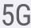
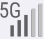
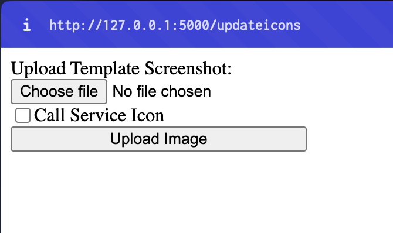
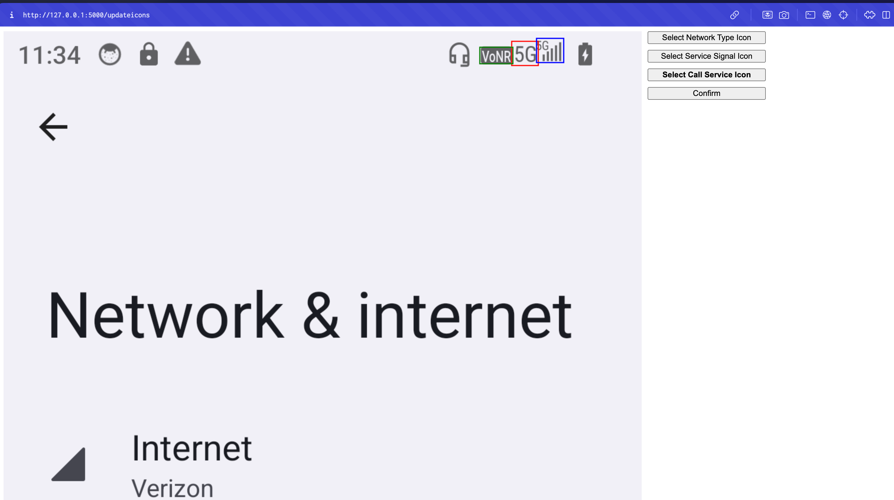
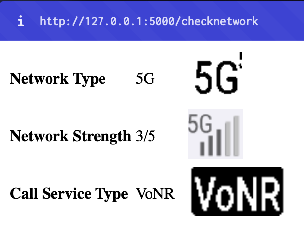

# Network Icon Test

Identify the type of network and call service icon that has appeared, and the signal strength displayed.

## Prerequisites

-   **Python**: Tested using version 3.11.8

### Python modules

-   **pytesseract**: Used for OCR
-   **opencv-python**: Used for image processing
-   **numpy**: Used for identifying signal strength

Install using:

```bash
pip install -r requirements.txt
```

## Usage

### Identify Network Icon

```
python networkicon.py -i <image-path> [-c <x1> <y1> <x2> <y2>]
```

### Identify Call Service Icon

```
python callserviceicon.py -i <image-path> [-c <x1> <y1> <x2> <y2>]
```

### Identify Signal Strength

```
python signalstrength.py -i <image-path> [-c <x1> <y1> <x2> <y2>]
```

### Crop Coordinates Option

The top-left and bottom-right coordinates of a crop can be passed into each script to crop the screenshot passed into the script.

### Example of images

| Type                 | Example Image             |
| -------------------- | ------------------------- |
| Network Icon         |     |
| Call Service Icon    |   |
| Signal Strength Icon |  |

## Output

### Network Icon

```
4G|5G
```

### Call Service Icon

```
VoLTE|VoNR
```

### Signal Strength

```
<Active Bars>/<Total Bars>
```

## Example with crop

```
python networkicon.py -i "../Resources/screenshot5G3Bars.png" -c 863 20 903 55
```

# Website

I have also created a website interface using flask to make cropping easier.
The website contains 2 pages, to update the coordinates for cropping templates of screenshots to extract the icons, and to check a new screenshot.

## Python Libraries

-   **Flask**: Used for setting up the web server

Install using:

```
pip install Flask
```

## Upload template



Upload image and select whether the screenshot contains a call service icon.

## Crop images



Select which icon and crop from image. Javascript is used to implement the client-side drag to select.

#### Check network



Upload a new screenshot and website will identify network type, strength and call service by cropping image and processing it.
